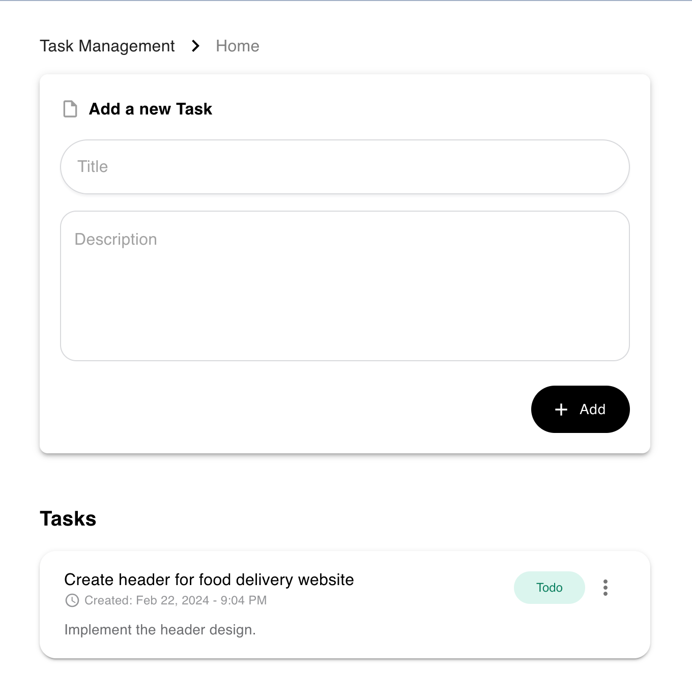
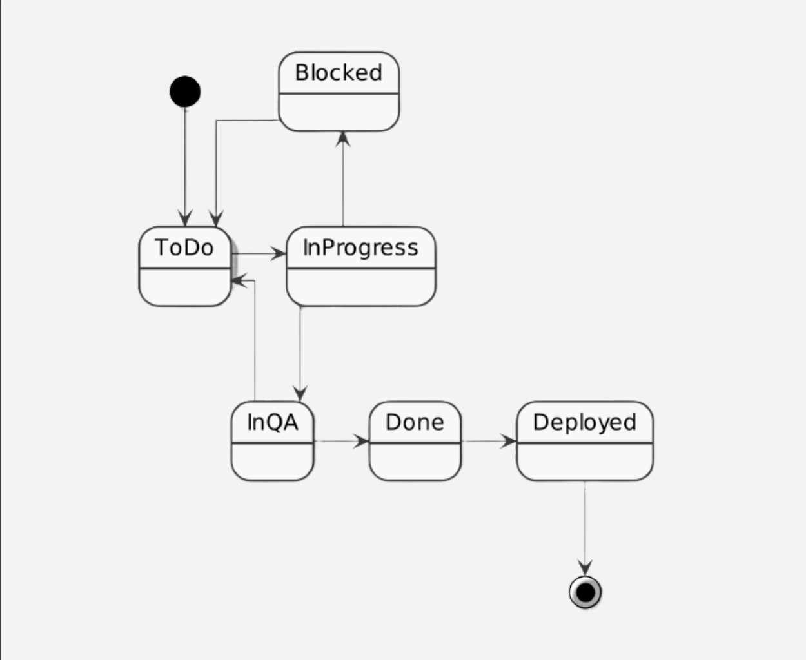

# Task Management App

## Overview
The Task Management App is a simple web application designed to help users manage their tasks effectively. It provides features for adding, editing, and deleting tasks, as well as tracking their status changes over time. The app also offers user-friendly interfaces for creating new tasks and updating existing ones.



## Features
- Add Task: `Users can add new tasks to the system by providing a title, description, and status.`
- Edit Task: `Existing tasks can be edited to update their title, description, and status.`
- Delete Task: `Users have the option to delete tasks they no longer need.`
- Task Status Tracking: `The app keeps a history of status changes for each task, allowing users to see when and how a task's status was modified.`

- Responsive Design: `The app is designed to work seamlessly on desktop and mobile devices, providing a consistent user experience across different screen sizes.`

## Technologies Used
- Frontend: `React.js, Material-UI`
- State Management: `React Context API`
- Routing: `React Router`
- Bundler: `Vite`
- Date Formatting: `date-fns`
- Storage: `Local Storage`

## Installation
1. Clone the repository: `git clone git@github.com:khyatibardolia/task-tracker-react-vite-app.git`
2. Navigate to the project directory: `cd task-tracker-react-vite-app`
3. Install dependencies: `npm install`

## Usage
1. Start the development server: `npm run dev`
2. Open the app in your browser: `http://localhost:5173/`

### Commit Convention
- To ensure readability and consistency in `commit messages`, the conventional commit format is used for writing commit messages that are `clear, concise, and informative`.
- Each commit message should adhere to the following pattern:

```
<type>(<scope>): <description>

[optional body]

[optional footer]

```

Where:

- `<type>` specifies the type of the commit (e.g., feat, fix, chore, docs, style).
- `<scope>` is optional and indicates the scope of the commit (e.g., component name, module).
- `<description>` is a short, concise description of the change.
- `[optional body]` provides additional context or details about the change.
- `[optional footer]` includes any relevant issue or breaking change references.

This convention helps in tracking and understanding the `purpose` of each commit.
See the section about [conventional commits](https://www.conventionalcommits.org/en/v1.0.0/#specification) for more information.

## Live Demo

The application is deployed on Netlify and can be accessed here:
https://task-tracker-react-vite-app.netlify.app/